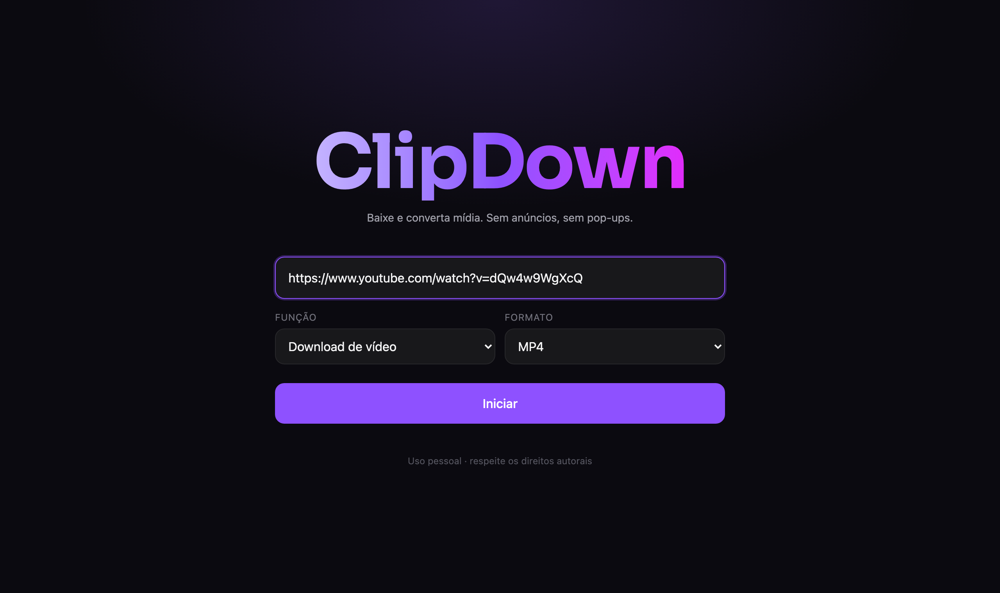
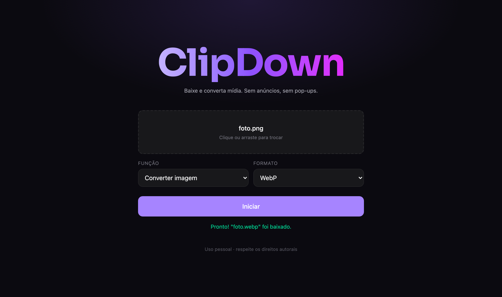
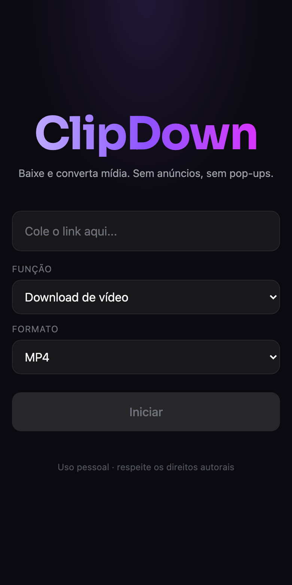

# ClipDown


> Ferramenta web de uso pessoal para conversão de imagens, conversão de vídeos (MP4 → MP3/GIF) e download de vídeos por URL — sem anúncios, sem pop-ups e sem sites maliciosos.

<p align="center">
  
</p>

## Sobre

O **ClipDown** é um projeto de **uso pessoal** criado para eliminar a dependência de sites de terceiros — repletos de anúncios e, muitas vezes, maliciosos — em tarefas simples de manipulação de mídia. Tudo roda localmente, com uma interface limpa e apenas o necessário.

### Funcionalidades

| Função | Entrada | Saída |
|---|---|---|
| **Download por URL** | Link de vídeo (YouTube, Instagram, TikTok, Twitter/X e outros sites suportados pelo yt-dlp) | Vídeo em **MP4** ou **WebM** |
| **Vídeo → MP3** | Arquivo de vídeo (MP4) | Áudio **MP3** |
| **Vídeo → GIF** | Arquivo de vídeo (MP4) | **GIF** animado |
| **Conversão de imagens** | Arquivo de imagem (JPG, PNG, WebP, GIF, BMP e outros que o ImageSharp lê) | **PNG, JPG, WebP, GIF** ou **BMP** |

### Como funciona a tela

A interface é de tela única e propositalmente minimalista:

- Em **Download de vídeo**, a caixa de texto recebe o **link**.
- Nas funções de conversão, a caixa de link dá lugar a uma **área de upload** (clique ou arraste o arquivo).
- Os selects **Função** e **Formato** definem o que fazer; os formatos disponíveis mudam conforme a função.
- Ao terminar, o arquivo processado é **baixado automaticamente**, e uma mensagem confirma o sucesso (ou explica o erro).

<p align="center">
  
  &nbsp;
  
</p>

### Roadmap

**MVP**

- [x] Download de vídeo por URL
- [x] Conversão MP4 → MP3
- [x] Conversão MP4 → GIF
- [x] Conversão de imagens entre formatos

**Futuro**

- [ ] **Upscaling de imagens** — melhorar qualidade/resolução via IA (candidatos: Real-ESRGAN via ONNX Runtime, ou API externa)
- [ ] Empacotar dependências (FFmpeg, yt-dlp) em imagem Docker
- [ ] Testes automatizados no backend
- [ ] Configurar a URL da API por ambiente no frontend (hoje está fixa em `localhost:5107`)

## Stack

| Camada | Tecnologia | Papel |
|---|---|---|
| Frontend | **Angular 21** + **Tailwind CSS 4** | SPA de tela única (signals e `fetch`) |
| Backend | **.NET 9 (ASP.NET Core Web API)** | Conversões, download por URL e orquestração das ferramentas externas |
| Imagens | [SixLabors.ImageSharp](https://github.com/SixLabors/ImageSharp) | Biblioteca .NET multiplataforma para ler/gravar JPG, PNG, WebP, GIF e BMP |
| Vídeo/áudio | [FFmpeg](https://ffmpeg.org/) | Conversão MP4 → MP3 e MP4 → GIF (GIF com paleta de cores gerada a partir do vídeo) |
| Download | [yt-dlp](https://github.com/yt-dlp/yt-dlp) | Download de vídeos por URL — suporta centenas de sites e é atualizado conforme as plataformas mudam |

> **Nota:** yt-dlp e FFmpeg são binários externos — precisam estar instalados no ambiente (e no `PATH`), ou embutidos via Docker no futuro. O FFmpeg também é usado pelo yt-dlp para juntar vídeo e áudio.
>
> **Licença do ImageSharp:** a biblioteca usa a *Six Labors Split License* (gratuita para código aberto e uso pessoal/pequeno porte). O build exibe um aviso pedindo uma licença; confira os termos em [sixlabors.com/pricing](https://sixlabors.com/pricing/) caso o uso do projeto mude.

## Como rodar (desenvolvimento)

Pré-requisitos:

- [Node.js](https://nodejs.org) + npm
- [SDK do .NET 9](https://dotnet.microsoft.com/download/dotnet/9.0)
- [FFmpeg](https://ffmpeg.org/download.html) e [yt-dlp](https://github.com/yt-dlp/yt-dlp/wiki/Installation) instalados e no `PATH`

```bash
# macOS (Homebrew)
brew install ffmpeg yt-dlp
```

```bash
# Terminal 1 — backend (ASP.NET Core) em http://localhost:5107
dotnet run --project backend/ClipDown.API --launch-profile http

# Terminal 2 — frontend (Angular) em http://localhost:4200
cd frontend
npm install     # só na primeira vez
npm start       # equivale a: ng serve
```

Abra **http://localhost:4200**.

> Use o perfil `http` do backend. O perfil `https` redireciona as chamadas e quebra o CORS durante o desenvolvimento.

### Testes

```bash
cd frontend
npm test        # Vitest (tela e chamadas à API)
```

Ainda não há projeto de testes no backend.

## API

Todas as rotas retornam **o arquivo processado** (com `Content-Disposition` contendo o nome sugerido). Em caso de erro, retornam `400` com um corpo [Problem Details](https://www.rfc-editor.org/rfc/rfc9457) cujo campo `detail` traz a mensagem.

| Método | Rota | Corpo | Descrição |
|---|---|---|---|
| `POST` | `/api/media/download` | JSON `{ "url": "...", "format": "mp4" \| "webm" }` | Baixa o vídeo do link informado |
| `POST` | `/api/media/convert/video` | `multipart/form-data`: `file`, `format` (`mp3` \| `gif`) | Converte um vídeo em áudio MP3 ou GIF |
| `POST` | `/api/media/convert/image` | `multipart/form-data`: `file`, `format` (`png` \| `jpg` \| `webp` \| `gif` \| `bmp`) | Converte uma imagem para outro formato |

Exemplos:

```bash
# Converter imagem
curl -F file=@foto.png -F format=webp http://localhost:5107/api/media/convert/image -o foto.webp

# Vídeo → MP3
curl -F file=@clipe.mp4 -F format=mp3 http://localhost:5107/api/media/convert/video -o clipe.mp3

# Baixar vídeo por URL
curl -X POST http://localhost:5107/api/media/download \
  -H "Content-Type: application/json" \
  -d '{"url":"https://exemplo.com/video","format":"mp4"}' -o video.mp4
```

### Limites e comportamentos

| Item | Valor |
|---|---|
| Upload de imagem | até 50 MB |
| Upload de vídeo (conversão) | até 200 MB; processamento limitado a 5 minutos |
| Download por URL | arquivo de até 500 MB; limitado a 10 minutos; apenas um vídeo por link (sem playlists) |
| Formatos | o nome do formato não diferencia maiúsculas de minúsculas (`jpeg` vale como `jpg`) |
| JPG | áreas transparentes de imagens (ex.: PNG) ficam **brancas** |
| MP4 no download | prefere **H.264 + AAC**, para tocar em qualquer player (QuickTime, iPhone, editores) |
| GIF | 15 fps e 480 px de largura; vídeos longos geram GIFs grandes |
| Links aceitos | somente `http` e `https` |

## Arquitetura

O backend é um único projeto ASP.NET Core. Cada funcionalidade é uma classe em `Services/`, que valida a entrada e faz o trabalho; o controller só cuida do HTTP:

```
MediaController  →  ImageConverter   (ImageSharp)
   (HTTP)        →  VideoConverter   (ffmpeg)
                 →  VideoDownloader  (yt-dlp)
```

O frontend é um único componente (`app.ts`) e um arquivo `api.ts` com as chamadas ao backend (usando `fetch`). As funções da tela ficam numa lista de configuração (`FUNCTIONS`), com a rota do backend, o tipo de entrada e os formatos de cada uma.

Decisões de design:

- **`Result<T>` em vez de exceções** para entradas inválidas (formato inexistente, arquivo que não é imagem, link inválido). Falhas inesperadas continuam sendo exceções e viram `500`.
- **Processos externos sem shell:** os argumentos do yt-dlp/ffmpeg são passados como lista, e a URL vem depois de `--`, para nunca ser interpretada como opção.
- **Arquivos temporários:** cada operação usa uma pasta temporária própria, apagada ao final.
- **CORS:** as origens permitidas ficam em `backend/ClipDown.API/appsettings.json` (`Cors:AllowedOrigins`).

## Estrutura do projeto

```
ClipDown/
├── README.md
├── docs/screenshots/            # Prints usados neste README
├── backend/
│   ├── ClipDown.sln
│   └── ClipDown.API/
│       ├── Program.cs           # Registro dos serviços e CORS
│       ├── Result.cs            # Result<T> e OutputFile
│       ├── appsettings.json
│       ├── Controllers/
│       │   └── MediaController.cs
│       └── Services/
│           ├── ImageConverter.cs
│           ├── VideoConverter.cs
│           ├── VideoDownloader.cs
│           └── ExternalProcess.cs   # Executa ffmpeg / yt-dlp
└── frontend/
    └── src/
        ├── main.ts
        ├── styles.css
        └── app/
            ├── app.ts / app.html    # Tela única
            └── api.ts               # Chamadas ao backend
```

## Notas

- Projeto de **uso pessoal**, sem fins comerciais.
- O backend não tem autenticação nem limite de requisições: **não o exponha na internet** como está.
- Ao baixar/converter conteúdo de plataformas de terceiros, respeite os **termos de serviço** das plataformas e os **direitos autorais** dos conteúdos.
